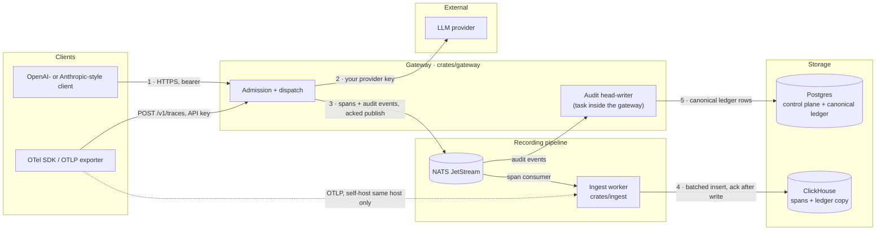
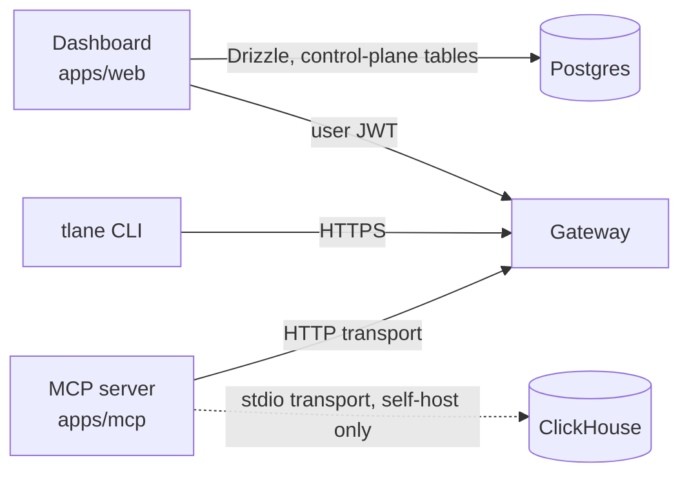
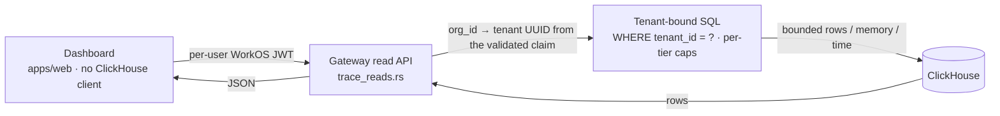
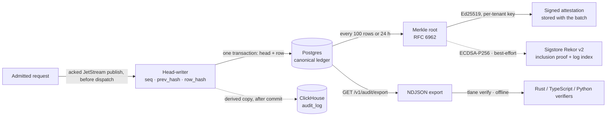

Tracelane is five components in one monorepo:

<CardGroup cols={2}>
  <Card title="Rust gateway" icon="bolt">
    Axum + tokio. BYOK routing across 205 routable providers (6 native adapters
    + 199 OpenAI-compatible catalog entries). One typed admission pipeline shared
    by the chat, embeddings and messages routes. Predictive layer inline,
    observe-first by default. Emits its own spans. <code>crates/gateway/</code>
  </Card>
  <Card title="Rust ingest workers" icon="arrow-down-to-bracket">
    OTLP receiver, NATS JetStream consumer, batched ClickHouse inserts
    acknowledged after the write. The only component that writes spans.
    <code>crates/ingest/</code>
  </Card>
  <Card title="Next.js 15 dashboard" icon="display">
    App Router, Tailwind 4, in-house components. Trace viewer with waterfall,
    transcript-spine and agent-lane views, rendered in the DOM. No ClickHouse
    client. <code>apps/web/</code>
  </Card>
  <Card title="TypeScript MCP server" icon="plug">
    Read-only, tenant-scoped, bearer-token auth. <code>npx @tracelanedev/mcp</code>,
    stdio or streamable-HTTP transport. <code>apps/mcp/</code>
  </Card>
  <Card title="Python eval orchestrator" icon="flask">
    Wraps DeepEval + Ragas + Inspect AI behind a unified API. Runs in CI. <code>evals/</code>
  </Card>
</CardGroup>

## Data flow

The other entry points all go through the same gateway; only two read storage
directly:

Solid edges are the hosted product's path. Dashed edges exist only in a
particular configuration: the ingest worker's own OTLP receiver is reachable
inside the deployment network over mTLS, or on a self-host install as a
plaintext port bound to the same host; the MCP server reads ClickHouse directly
only on its stdio transport with `CLICKHOUSE_URL` set, and its HTTP transport
refuses to start with that variable present. The ClickHouse ledger copy and the
best-effort Sigstore Rekor anchor appear in the ledger diagram below.

### Write path

A request enters the gateway through one typed admission pipeline shared by
`/v1/chat/completions`, `/v1/embeddings` and `/v1/messages`. Its order is fixed
in code and checked at compile time: authenticate (a WorkOS JWT or a `tlane_`
API key, resolved to an internal tenant UUID) → scope → parse → entitlements →
rate limit → key and workspace budgets → predictive layer (observe-first: its
verdict is recorded on the request and enforced only when the operator sets
`TRACELANE_PREDICTIVE_ENFORCE=1`) → audit publish. The audit publish is an
acknowledged JetStream write, and it fails closed: if the ledger cannot take the
event the request is refused with `503 audit_unavailable`, before any byte
reaches a provider.

After admission the chat handler resolves the provider and the tenant's own
provider key, runs the inline guardrail rails over the request (a rail verdict
is recorded to the ledger either way; a security rail can refuse the call with
`403`), wraps tool-result content in an `<UNTRUSTED_USER_DATA>` sentinel, and
dispatches with one same-provider retry. Cross-provider failover is off by
default and enabled per request with `X-Tracelane-Failover: cross-provider`;
a failover that served the request is named on the span.

The gateway's own spans, and any OTLP batch a client sends to `POST /v1/traces`,
are published to NATS JetStream with an acknowledged publish and a per-span
`Nats-Msg-Id`, so a republished span is dropped at the boundary. The ingest
consumer takes the tenant from the subject the message arrived on, never from
the span body, tail-samples (errors and spans carrying an intervention are
always kept; the default keep rate is 100%), batches the inserts, and acknowledges a
message only after the ClickHouse write returns — a failed insert leaves the
message unacknowledged and JetStream redelivers it.

Span deletion follows the plan's queryable window (Free 30 days, every paid tier
730 days), applied by an entitlement-driven sweep job that reads the plan table;
the table's own TTL is a backstop behind it. Retention is not customer-configurable.

### Read path

The dashboard has no ClickHouse client. It forwards the signed-in user's WorkOS
token to the gateway's read routes (`/v1/traces`, `/v1/sessions`, `/v1/slo`,
`/v1/costs`, `/v1/guardrails/*`, `/v1/query/signatures` and the rest), which
resolve the tenant from the validated claim — never from the path, query string
or body — bind it first in a parameterised `WHERE tenant_id = ?`, and wrap the
SELECT in a per-tier `SETTINGS` clause that caps rows read, memory and execution
time. A trace that belongs to another tenant answers the same `404` as one that
does not exist. Two CI guards hold this: one fails any query against
`tracelane.*` whose literal carries no tenant filter, the other fails any
ClickHouse read outside the capped wrapper.

### The ledger

Each admitted request is appended as a row in a per-tenant hash chain, and
guardrail verdicts are appended the same way:
`row_hash = SHA-256(tenant_id ‖ seq ‖ type ‖ actor ‖ canonical_payload ‖
prev_hash)`, domain-separated and length-prefixed over the RFC 8785 canonical
payload. A single head-writer task inside the gateway assigns `seq` and commits
the row and the chain head in one Postgres transaction; the ClickHouse
`audit_log` table is a derived copy written after that commit, and the boot-time
reconcile that rebuilds it recomputes each candidate row's content hash before
adopting it into the canonical store.

Batches close every 100 rows or after 24 hours, whichever comes first. Each
batch's RFC 6962 Merkle root is signed with the tenant's own Ed25519 key, and
the signed attestation binds the root to the batch's anchor state so a stripped
or downgraded export fails offline verification. The root is additionally
submitted to the public Sigstore Rekor v2 transparency log on a best-effort
basis when the deployment configures a Rekor endpoint; an anchored batch carries
the resolved inclusion proof, checkpoint and log index, and an unanchored batch
stays signed-locally and still verifies its chain. Anchoring is per batch, never
per event. The export
(`GET /v1/audit/export`) streams the canonical Postgres rows and anchor records
as NDJSON and fails closed: a read error aborts the transfer rather than
returning a partial ledger. `tlane verify` recomputes the chain offline; the
Rust, TypeScript and Python reference verifiers are held to the same verdicts on
committed conformance vectors in CI.

A self-host install with no Postgres control plane keeps a process-local chain
and writes the ClickHouse copy on a best-effort basis; that tier has no
canonical store and should not be read as the same durability as the hosted
ledger.

## Source-of-truth split

| Datum | Lives in | Notes |
|---|---|---|
| Tenant and user metadata, API keys, entitlements, plan and billing state | Postgres | Written by the dashboard through Drizzle; plan state is updated by the signature-verified billing webhook. Read by the gateway through in-process caches rather than per request. |
| Spans and trace summaries | ClickHouse | Ingest is the only writer. Deleted at the end of the plan's queryable window by the sweep job. |
| Canonical audit chain rows and anchor records | Postgres | Same transaction as the chain head. Export and self-verify read here and never fall back to the copy. |
| Derived audit copy and guardrail verdicts | ClickHouse | Written by the gateway after commit; rebuilt by the boot reconcile. Dashboard reads. |
| Prompt versions, promotion decisions, rollback events | ClickHouse | Read by the gateway's prompt router. |
| Online-eval policies | Postgres | The policy rows; the score rows are in ClickHouse. |
| Usage meters | ClickHouse | Counters written on the hot path and daily gauges from a metering job, which emits usage to the billing provider and records a day's completion marker only after every emission succeeded. |

## Performance

The gateway-overhead figure is **measured**: 2 ms p50 / 4 ms p95 / 5 ms p99 over
the direct-to-mock baseline, 2026-09-07, LiteLLM's AIGatewayBench harness on a
4 vCPU host, two runs, capture on. Method, caveats and the other gateways are on
the [benchmark page](/benchmarks). The benchmark script enforces a p99 below
25 ms as a k6 threshold; that job runs on demand, not on every change.

The predictive layer's `<30ms p50 / <50ms p95 / <100ms p99` figure is an
engineering target, not a measurement on production-equivalent hardware — see
[Predictive guardrails](/predictive-guardrails). No other latency or throughput
figure for ingest, the dashboard, the MCP server or the eval layer has been
measured or is enforced, so none is published here.

## Security posture

- **BYOK.** Provider keys are sealed with AES-256-GCM (`ring` AEAD) and bound to
  the tenant and provider. The gateway uses the deployment master key by default;
  an entitled workspace can configure a customer KMS wrapped tenant data key
  for provider-key envelopes through `/v1/security/kms`.
- **mTLS for ingest, TLS 1.3 only.** The ingest worker's OTLP receiver
  terminates mTLS itself and is built with TLS 1.3 as its only protocol
  version; plaintext mode exists for local development.
- **Tenant identity comes from a validated credential.** Read routes resolve the
  tenant from the claim and bind it in SQL; the query wrapper adds the resource
  caps and leaves the tenant filter to the caller, which the CI guard checks per
  query literal.
- **Outbound calls to customer-supplied URLs are pinned.** The SSRF guard
  validates the scheme and resolved addresses and returns the addresses it
  checked; the alert-webhook and Vertex token-endpoint clients connect to
  exactly those addresses, so a DNS answer that changes after validation is not
  followed.
- **Per-service data-plane credentials.** The gateway and ingest processes
  authenticate to NATS with their own credentials and derive a private
  reply-inbox prefix from that credential, so one service cannot receive the
  other's deliveries. CI proofs run the real clients against the deployment's
  NATS authorization and ClickHouse grants and assert the refusals, not only
  the grants.
- **Prompt-injection-aware.** Tool-result messages and tool-result content
  parts in a proxied request are wrapped in `<UNTRUSTED_USER_DATA>` before the
  model sees them; user turns are left alone.
- **Trusted Publishing OIDC only.** npm, PyPI and crates.io publishes mint
  short-lived tokens from the workflow's OIDC identity; the release workflows
  reference no stored registry secret.
- **Sigstore signing + CycloneDX SBOM.** Live on tagged release artifacts since
  `v0.2.3` — each binary ships a `.cosign.bundle`, `sbom.cyclonedx.json` is
  attached and signed — as well as on the container image and a weekly
  repository SBOM.

## Related

- [Predictive guardrails](/predictive-guardrails) — what runs inline
- [Audit ledger](/audit-ledger) — the chain, signing and anchoring in detail
- [Providers](/providers) — 205 routable LLM providers
- [API reference](/api-reference) — REST surface
- [Decisions](/decisions/index) — architectural decisions
