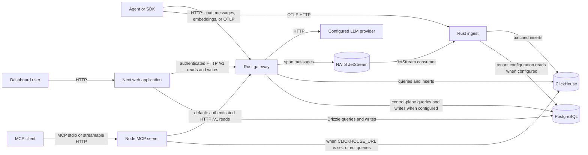
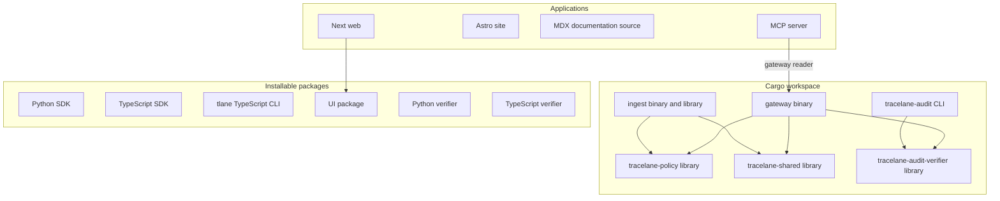
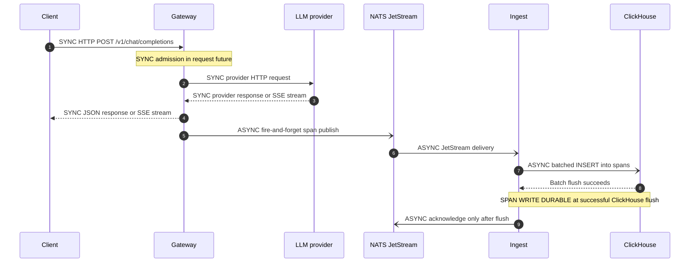
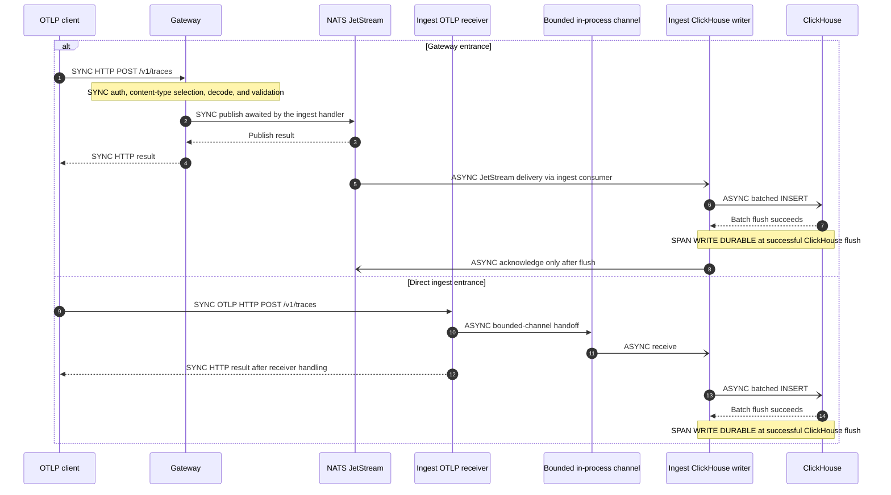
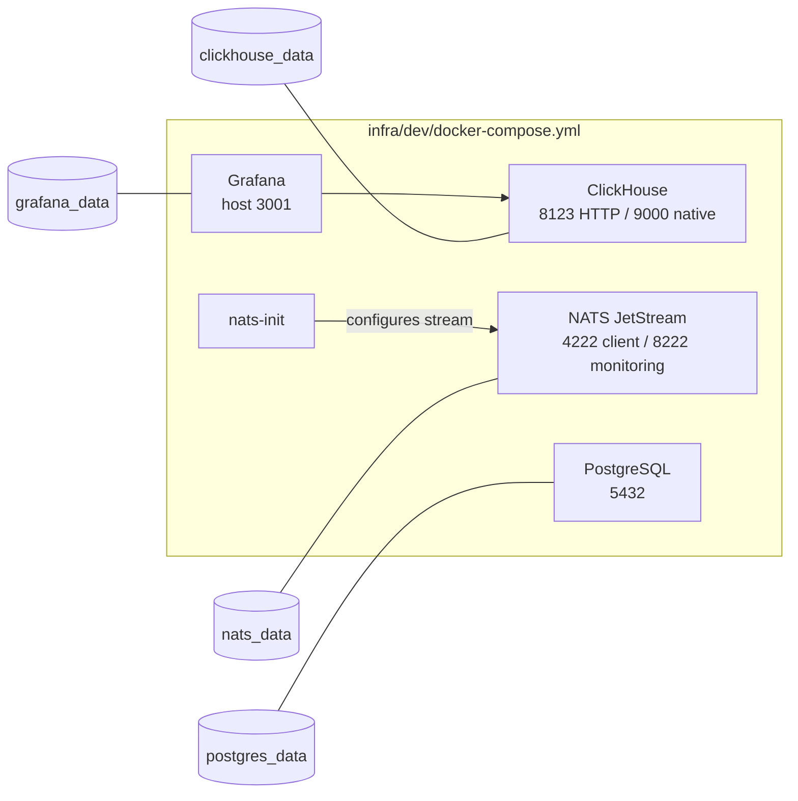
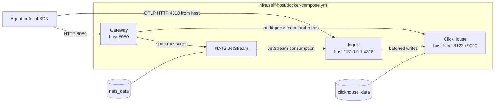

# Architecture diagrams as built

These diagrams contain only relationships and objects established by the referenced
source files. They intentionally omit behavior that the checked-in source does not
establish.

## System context

_Derived from `crates/gateway/src/server.rs`, `crates/ingest/src/main.rs`, `apps/web/lib/gateway.ts`, `apps/mcp/src/index.ts`, and `apps/mcp/src/reader.ts`; 2026-09-19._



## Component graph

_Derived from the workspace manifests, application manifests, `crates/gateway/src/server.rs`, `crates/ingest/src/main.rs`, and `apps/mcp/src/reader.ts`; 2026-09-19._



The graph does not connect the Astro site or documentation source to runtime data-plane
components because the examined manifests do not establish such a connection.

## Request path: OpenAI-compatible chat completion

_Derived from `crates/gateway/src/server.rs`, `crates/gateway/src/server/chat.rs`, `crates/gateway/src/otlp_emit.rs`, `crates/ingest/src/nats_consumer.rs`, and `crates/ingest/src/clickhouse_writer.rs`; 2026-09-19._



The diagram omits a client-visible result for a runtime NATS publish failure because the
verified source only establishes that span publication is fire-and-forget. It also omits
a uniform provider-outage response because no single response was verified for every
provider adapter.

## Request path: OTLP span ingest through both entrances

_Derived from `crates/gateway/src/trace_ingest.rs`, `crates/ingest/src/otlp_receiver.rs`, `crates/ingest/src/main.rs`, `crates/ingest/src/nats_consumer.rs`, and `crates/ingest/src/clickhouse_writer.rs`; 2026-09-19._



The direct-ingest branch does not claim that the HTTP success response waits for
ClickHouse durability; the verified source establishes the channel handoff and later
batch flush, not such an acknowledgement contract.

## Request path: dashboard read

_Derived from `apps/web/lib/gateway.ts` and `crates/gateway/src/trace_reads.rs`; 2026-09-19._

```mermaid
sequenceDiagram
    autonumber
    participant B as Browser
    participant W as Next web application
    participant G as Gateway
    participant CH as ClickHouse

    B->>W: SYNC HTTP page or application API request
    W->>G: SYNC authenticated HTTP GET /v1/*
    G->>CH: SYNC tenant-scoped ClickHouse query
    CH-->>G: SYNC query result or error
    G-->>W: SYNC HTTP JSON result or error
    W-->>B: SYNC rendered/page response
    Note over B,CH: Read-only path; no durable write is established
```

The diagram omits a direct browser-to-ClickHouse edge because the verified web proxy
source states that trace and SLO reads go through the gateway.

## Deployment topology: contributor development

_Derived only from `infra/dev/docker-compose.yml`; 2026-09-19._



Gateway, ingest, web, site, and MCP nodes are omitted because the development Compose
file does not declare those services.

## Deployment topology: single-node self-host

_Derived only from `infra/self-host/docker-compose.yml`; 2026-09-19._



PostgreSQL, Grafana, web, site, and MCP nodes are omitted because the self-host Compose
file does not declare those services.

## ClickHouse data model

Entity names ending in `_DERIVED` are materialized or aggregate objects derived from
other ClickHouse data. An entity without a relationship line is still declared by the
schema/migrations, but no relationship is asserted here unless the checked-in source
establishes it.

_Derived from `infra/dev/clickhouse/schema.sql` and `infra/dev/clickhouse/migrations/*.sql`; 2026-09-19._

```mermaid
erDiagram
    SPANS {
        string tenant_id PK
        string trace_id PK
        string span_id PK
        string parent_span_id
        datetime start_time
        string attributes
    }
    TRACE_SUMMARIES_DERIVED {
        string tenant_id PK
        string trace_id PK
        uint span_count
        uint error_count
    }
    SLO_HOURLY_STATS_DERIVED {
        string tenant_id PK
        datetime bucket_hour PK
        string provider PK
        string model PK
    }
    TOKEN_ECONOMICS_DERIVED {
        string tenant_id
    }
    TTFT_STATS_DERIVED {
        string tenant_id
    }
    SLO_MINUTE_STATS_DERIVED {
        string tenant_id
    }
    SLO_ALERTS {
        string tenant_id PK
        datetime alert_time PK
        string alert_type
    }
    AUDIT_LOG {
        string tenant_id PK
        uint seq PK
        string prev_hash
        string row_hash
    }
    AUDIT_ANCHOR_RECORDS {
        string tenant_id PK
        uint batch_start_seq PK
        uint batch_end_seq
    }
    GUARDRAIL_VERDICTS {
        string tenant_id PK
        string correlation_id PK
        datetime event_time PK
    }
    FEDERATION_SIGNALS {
        string tenant_id
    }
    METER_COUNTERS {
        string tenant_id PK
        date day PK
        string meter PK
        string dim PK
        string source PK
    }
    METER_GAUGES {
        string tenant_id PK
        date day PK
        string meter PK
    }
    BLOBS {
        string tenant_id PK
        binary hash PK
        string bytes
    }
    BLOB_REFS {
        string tenant_id PK
        binary hash PK
        string span_id
        date day
    }
    PROMPTS {
        string tenant_id
        string name
    }
    PROMPT_VERSIONS {
        string tenant_id
        string prompt_name
    }
    EVAL_RUNS {
        string tenant_id
    }
    EVAL_RUN_ITEMS {
        string tenant_id
    }
    PROMOTION_DECISIONS {
        string tenant_id
    }
    ROLLBACK_EVENTS {
        string tenant_id
    }
    SEMANTIC_CACHE {
        string tenant_id
    }
    DATASETS {
        string tenant_id
    }
    DATASET_ITEMS {
        string tenant_id
    }
    DATASET_SNAPSHOTS {
        string tenant_id
    }
    DATASET_SNAPSHOT_ITEMS {
        string tenant_id
    }
    EXPERIMENTS {
        string tenant_id
    }
    EXPERIMENT_ARMS {
        string tenant_id
    }
    ONLINE_EVAL_SCORES {
        string tenant_id
    }
    TRACE_CONTENT_SNAPSHOTS {
        string tenant_id
        string trace_id
    }

    SPANS ||--o{ TRACE_SUMMARIES_DERIVED : materializes
    SPANS ||--o{ SLO_HOURLY_STATS_DERIVED : materializes
    SPANS ||--o{ TOKEN_ECONOMICS_DERIVED : materializes
    SPANS ||--o{ TTFT_STATS_DERIVED : materializes
    SPANS ||--o{ SLO_MINUTE_STATS_DERIVED : materializes
    BLOBS ||--o{ BLOB_REFS : referenced_by
    SPANS ||--o{ BLOB_REFS : span_id
    AUDIT_LOG ||--o{ AUDIT_ANCHOR_RECORDS : sequence_range
```



## PostgreSQL data model

_Derived from the table and foreign-key declarations in `apps/web/db/schema.ts` and `apps/web/db/migrations/*.sql`; 2026-09-19._

```mermaid
erDiagram
    TENANTS {
        uuid id PK
    }
    PLAN_ENTITLEMENTS {
        string plan_lookup_key PK
    }
    WORKSPACE_ENTITLEMENTS {
        uuid tenant_id FK
        string plan_lookup_key FK
    }
    ALERT_DESTINATIONS {
        uuid id PK
        uuid tenant_id FK
    }
    ALERT_RULES {
        uuid id PK
        uuid tenant_id FK
        uuid destination_id FK
    }
    CMK_KEYS {
        uuid id PK
        uuid tenant_id FK
    }
    API_KEYS {
        uuid id PK
        uuid tenant_id FK
    }
    WEBHOOK_EVENTS {
        string id PK
    }
    ADMIN_AUDIT_LOG {
        uuid id PK
    }
    PROVIDER_KEYS {
        uuid id PK
        uuid tenant_id FK
    }
    AUDIT_CHAIN_STATE {
        uuid tenant_id PK, FK
    }
    TENANT_AUDIT_KEYS {
        uuid tenant_id FK
    }
    PAYMENT_EVENTS {
        uuid tenant_id FK
    }
    USERS {
        uuid tenant_id FK
    }
    SUPPORT_REQUESTS {
        uuid id PK
    }
    OBSERVED_TOOLS {
        uuid tenant_id FK
    }
    TOOL_CAPABILITIES {
        uuid tenant_id FK
        string tool_name PK
    }
    AUDIT_APPENDED {
        string event_id PK
        datetime appended_at
    }
    QUOTA_NOTIFICATIONS {
        uuid id PK
    }
    TRACE_ANNOTATIONS {
        uuid tenant_id FK
        uuid queue_id FK
    }
    ANNOTATION_QUEUES {
        uuid id PK
        uuid tenant_id FK
    }
    NOTIFICATIONS {
        uuid tenant_id FK
    }
    ONLINE_EVAL_POLICIES {
        uuid tenant_id FK
    }
    DASHBOARDS {
        uuid id PK
        uuid tenant_id FK
    }
    DASHBOARD_TILES {
        uuid dashboard_id FK
    }
    TRACE_SHARES {
        uuid tenant_id FK
    }
    PRICING_RATES {
        string meter
    }
    BILLING_POLICY {
        string key
    }
    METER_WARNINGS {
        uuid tenant_id FK
    }

    TENANTS ||--o{ WORKSPACE_ENTITLEMENTS : has
    PLAN_ENTITLEMENTS ||--o{ WORKSPACE_ENTITLEMENTS : selects
    TENANTS ||--o{ ALERT_DESTINATIONS : has
    TENANTS ||--o{ ALERT_RULES : has
    ALERT_DESTINATIONS ||--o{ ALERT_RULES : receives
    TENANTS ||--o{ CMK_KEYS : has
    TENANTS ||--o{ API_KEYS : has
    TENANTS ||--o{ PROVIDER_KEYS : has
    TENANTS ||--o| AUDIT_CHAIN_STATE : has
    TENANTS ||--o{ TENANT_AUDIT_KEYS : has
    TENANTS ||--o{ PAYMENT_EVENTS : has
    TENANTS ||--o{ USERS : has
    TENANTS ||--o{ OBSERVED_TOOLS : has
    TENANTS ||--o{ TOOL_CAPABILITIES : has
    TENANTS ||--o{ TRACE_ANNOTATIONS : has
    ANNOTATION_QUEUES ||--o{ TRACE_ANNOTATIONS : contains
    TENANTS ||--o{ ANNOTATION_QUEUES : has
    TENANTS ||--o{ NOTIFICATIONS : has
    TENANTS ||--o{ ONLINE_EVAL_POLICIES : has
    TENANTS ||--o{ DASHBOARDS : has
    DASHBOARDS ||--o{ DASHBOARD_TILES : contains
    TENANTS ||--o{ TRACE_SHARES : has
    TENANTS ||--o{ METER_WARNINGS : has
```



`WEBHOOK_EVENTS`, `ADMIN_AUDIT_LOG`, `AUDIT_APPENDED`, `SUPPORT_REQUESTS`,
`QUOTA_NOTIFICATIONS`, `PRICING_RATES`, and `BILLING_POLICY` are shown without invented
relationships because the examined schema and migrations do not declare a foreign key
from those entities.
